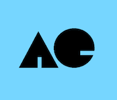
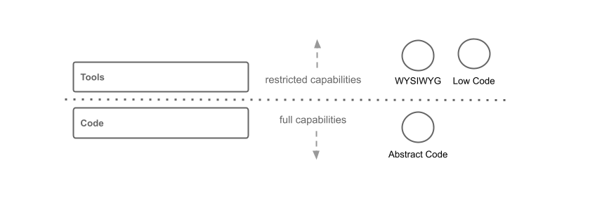

Welcome to "Abstract Code" Programming. This publication is to show and discuss approaches for building software using ***real programming*** code in an abstract and versatile way. Approaches, that go beyond hard-core programming but also beyond "Low Code". You will:

* ***Learn*** about abstract ways to develop software
* ***See*** different approaches for different problems
* ***Develop*** software using abstract programming languages

### TL;DR

> Abstract Code Programing doesn't have an official definition. It is discussed here as a development approach that aims to provide a way to develop software using programming languages that are designed with abstract principles and are accessible even for non programmers. Projects, like the abstract programming language PUZZLE are developed and discussed.

---

# Why abstract code?

> Abstract code makes things simple, understandable and accessible, while still providing a wide range of capabilities. Code can do more compared to drag-n-drop tools. 

Usually, learning and understanding a programming language isn't so easy (except for pros). So in the last decades, different approaches have been born in order to make "creating software" available for non-professionals and easier for professionals. Common examples are Low Code Platforms, drag-n-drop programming tools or WYSIWYG software. These approaches all work with abstraction.

Abstraction has been around since computers were created. Abstraction works on the concept of removing complexity in order to make something simpler. The approaches mentioned above are offering a way to create something in a simpler fashion compared to writing compex programming code. The price, one has to pay here is missing capabilities. That is why oftentimes these tools focus on specific tasks or domains. Like tools for creating Graphical User Interfaces or tools for building business workflows.

***Abstract Code***, on the other side uses programming code instead of graphical tools. Opposed to typical general-purpose programming languages, the abtract code language is designed to be understandable, using abstract syntax. You will learn more about the language structure [here](LANGUAGE-GUIDE).

# Projects

As part of this publication, some technologies that make abstract coding possible, are being created and discussed. There technologies are open source.

## PUZZLE - abstract language

When we talk about abstract code, we need an abstract programming language. The PUZZLE project is an approach to  reate a real programmming language, that is designed with abstraction in mind. Along with the resources shown in this publication, PUZZLE will be discussed.

## OBJY - abstract framework

Besides having a language for development, frameworks are a must-use for building software. OBJY is a framework, that works with behaviour-driven, dynamic objects as piece of abstraction.

---

# Content and Roadmap

- [x] <b>[Cover](/)</b>
- [x] <b>[Intro](README)</b>
- [x] <b>[Knowledge](BASICS) </b>
	- [x] Some important basics
- [x] <b>[The Language](LANGUAGE-GUIDE) </b>
	- [x] Learn what an abstract coding language should look like
	- [ ] Learn abstract language/programming concepts
	- [ ] Learn PUZZLE, an abstract language
- [ ] <b>[Build something](BUILD)</b>
	- [ ] Create your own projects using abstract code
- [x] <b>[About](ABOUT)</b>
	- [x] About this publication
- [ ] More chapters to come